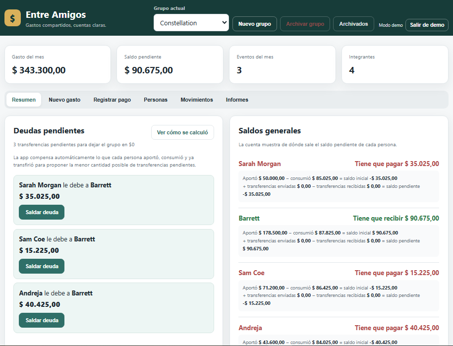
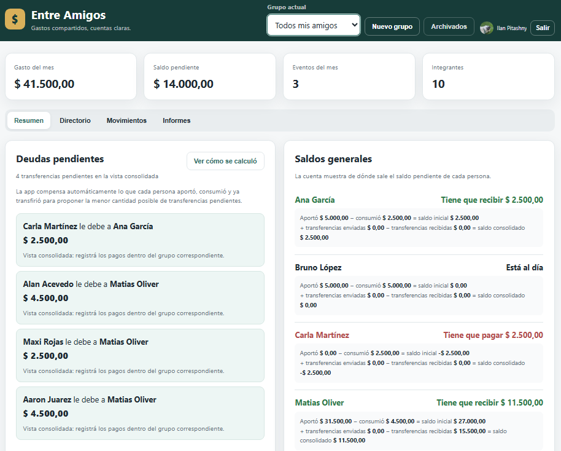
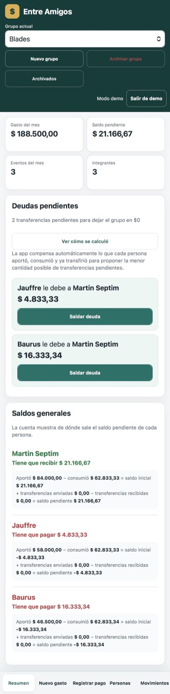

# 💸 Entre Amigos

<p align="center">
  <strong>Gastos compartidos, cuentas claras.</strong>
</p>

<p align="center">
  Progressive Web App full-stack para organizar gastos compartidos, grupos, saldos y transferencias.
</p>

<p align="center">
  <a href="https://entre-amigos-five.vercel.app/"><strong>🌐 Probar la aplicación</strong></a>
  ·
  <a href="https://github.com/Ilan-Py/Entre-Amigos"><strong>💻 Repositorio</strong></a>
</p>

> **¿Querés probarla sin registrarte?** Ingresá al deploy y elegí **Probar demo**.  
> Cada visitante recibe una sesión temporal e independiente con datos ficticios.



---

## 📌 Sobre el proyecto

**Entre Amigos** nació como una aplicación para simplificar la administración de gastos entre amigos, viajes, convivencias y otros grupos.

La aplicación permite registrar quién pagó, quién participó de cada gasto y cuánto corresponde a cada persona. A partir de esos movimientos calcula los saldos individuales y propone automáticamente las transferencias necesarias para dejar las cuentas saldadas.

El proyecto evolucionó hasta convertirse en una **PWA full-stack**, con autenticación mediante Google, persistencia en PostgreSQL, múltiples usuarios, directorio global de personas, informes, diseño responsive y una demo pública aislada por sesión.

---

## ✨ Funcionalidades principales

### 👥 Grupos y personas

- Creación y administración de múltiples grupos.
- Directorio general de personas.
- Reutilización de una misma persona en diferentes grupos.
- Posibilidad de ocultar personas sin eliminar su historial.
- Archivado de grupos finalizados.
- Registro de alias bancario y teléfono.
- Vista global **Todos mis amigos**.

### 💳 Gastos compartidos

- Uno o varios pagadores por gasto.
- Selección de los participantes involucrados.
- División automática en partes iguales.
- Distribución personalizada cuando el gasto no se divide por igual.
- Seleccionar/deseleccionar todos los participantes.
- Categorías de gastos.
- Historial de movimientos.

### 🔄 Deudas y transferencias

Entre Amigos calcula el **balance neto** de cada integrante y propone una cantidad reducida de transferencias para saldar las cuentas.

Las transferencias realizadas pueden registrarse desde la propia aplicación y los saldos se recalculan automáticamente.

---

## 🌎 Todos mis amigos

La aplicación incorpora una vista consolidada que funciona como un **supergrupo**.

Desde allí se puede consultar el estado general de las personas independientemente de los grupos en los que participaron, visualizar saldos consolidados, acceder al directorio maestro y generar informes generales.



Esto también evita tener que crear copias de una misma persona para cada grupo: una persona puede formar parte de varios grupos manteniendo una única identidad dentro de la cuenta.

---

## 📊 Informes

Los informes permiten consultar:

- gastos realizados;
- movimientos;
- saldos individuales;
- deudas pendientes;
- transferencias necesarias;
- información para realizar pagos;
- resultados por persona;
- resultados por período.

---

## 🧪 Demo pública

Entre Amigos puede probarse sin crear una cuenta.

La demo utiliza **el mismo backend y PostgreSQL que la aplicación real**, pero cada visitante recibe un conjunto independiente de datos ficticios.

### ¿Cómo funciona?

- Cada visitante recibe su propia sesión demo.
- Los cambios persisten al recargar.
- Ningún visitante modifica la demo de otra persona.
- La sesión tiene una duración limitada.
- Los datos pueden volver al estado inicial mediante **Restablecer demo**.
- Las sesiones vencidas se eliminan para evitar acumular datos innecesarios.

Esto permite probar libremente la aplicación —crear gastos, registrar pagos o modificar grupos— sin afectar información real ni la experiencia de otros visitantes.

**👉 [Abrir la demo](https://entre-amigos-five.vercel.app/)**

---

## 🔐 Autenticación y aislamiento de datos

Los usuarios pueden iniciar sesión mediante su cuenta de **Google**.

Los datos almacenados quedan asociados al usuario autenticado, permitiendo mantener separados:

- grupos;
- personas;
- gastos;
- pagos;
- movimientos;
- informes.

El selector de Google permite además trabajar correctamente en dispositivos donde existen varias cuentas iniciadas.

---

## 📱 Progressive Web App

Entre Amigos está desarrollada como **Progressive Web App (PWA)**.

Puede utilizarse directamente desde el navegador o instalarse como una aplicación en dispositivos compatibles.

<p align="center">
  
</p>

La interfaz incluye:

- diseño responsive para desktop y mobile;
- navegación adaptada a pantallas pequeñas;
- instalación como PWA;
- Service Worker;
- manifest de aplicación;
- experiencia táctil;
- modo oscuro automático según la configuración del dispositivo.

---

## 🛠️ Stack tecnológico

| Área | Tecnologías |
|---|---|
| **Frontend** | HTML5, CSS3, JavaScript |
| **Backend** | Node.js, Express, API REST |
| **Base de datos** | PostgreSQL, Neon |
| **Autenticación** | Google OAuth |
| **Aplicación** | Progressive Web App |
| **Deploy** | Vercel |
| **Control de versiones** | Git, GitHub |

---

## 🏗️ Arquitectura

```text
┌───────────────────────────────┐
│            Cliente            │
│                               │
│    HTML · CSS · JavaScript    │
│              PWA              │
└───────────────┬───────────────┘
                │
                │ HTTP / REST
                ▼
┌───────────────────────────────┐
│            Backend            │
│                               │
│       Node.js · Express       │
│           API REST            │
└───────────────┬───────────────┘
                │
                ▼
┌───────────────────────────────┐
│          PostgreSQL           │
│             Neon              │
└───────────────────────────────┘
```

La autenticación permite identificar al usuario antes de acceder a los recursos de la API y mantener aislada la información correspondiente a cada cuenta.

---

## 🧠 Decisiones de diseño

### Simplificación de deudas

Mostrar cada deuda originada individualmente puede producir una cantidad innecesaria de transferencias.

Entre Amigos trabaja sobre el balance resultante de cada participante y propone una forma simplificada de saldar las cuentas.

### Directorio global

Las personas no existen únicamente dentro de un grupo.

La aplicación mantiene un directorio general para poder reutilizarlas en distintos grupos y reducir duplicados.

### Historial sin eliminación destructiva

Cuando una persona ya participó de movimientos, eliminarla físicamente puede afectar la integridad del historial.

Por eso la aplicación permite **ocultar personas** y **archivar grupos** sin destruir los movimientos anteriores.

### Demo aislada por sesión

En lugar de utilizar una única cuenta demo compartida, cada visitante recibe una sesión independiente y temporal.

Así la demo continúa siendo completamente interactiva sin que un visitante pueda alterar lo que verá el siguiente.

### Mobile-first y tema del dispositivo

La interfaz fue adaptada para funcionar tanto en desktop como en dispositivos móviles. El modo claro u oscuro se selecciona automáticamente mediante las preferencias del sistema.

---

## 🚀 Ejecutar localmente

Cloná el repositorio:

```bash
git clone https://github.com/Ilan-Py/Entre-Amigos.git
cd Entre-Amigos
```

Instalá las dependencias:

```bash
npm install
```

Iniciá el proyecto:

```bash
npm start
```

Para utilizar las funcionalidades completas es necesario configurar las variables de entorno correspondientes a PostgreSQL y Google OAuth.

> Las credenciales y secretos utilizados en producción no forman parte del repositorio.

---

## 🔗 Links

- **Aplicación:** https://entre-amigos-five.vercel.app/
- **Repositorio:** https://github.com/Ilan-Py/Entre-Amigos/
- **GitHub:** https://github.com/Ilan-Py
- **LinkedIn:** https://www.linkedin.com/in/ilan-pitashny

---

## 👨‍💻 Autor

**Ilan Pitashny**  
Estudiante de Desarrollo de Software.

Proyecto desarrollado como parte de mi portfolio personal, con foco en desarrollo full-stack, persistencia de datos, diseño de APIs, autenticación y experiencia de usuario.

<p align="center">
  <strong>Entre Amigos</strong><br>
  <sub>Gastos compartidos, cuentas claras.</sub>
</p>
